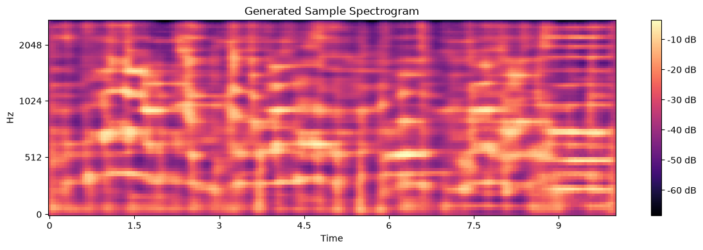
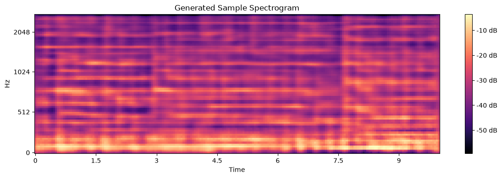
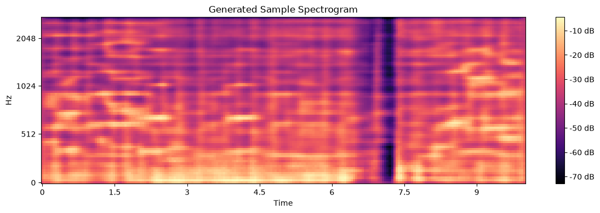
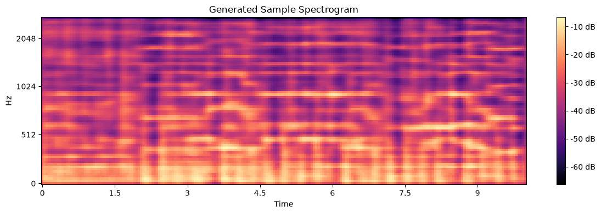
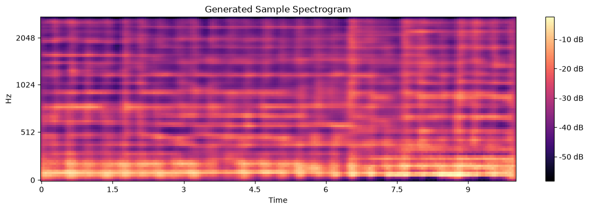
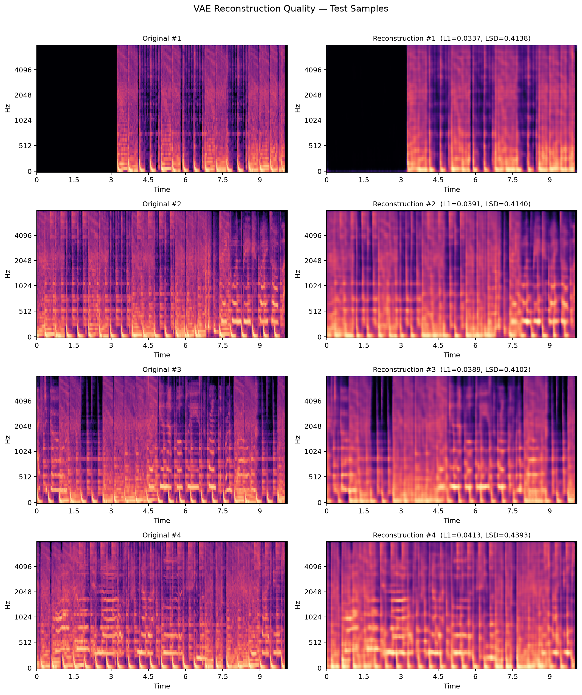
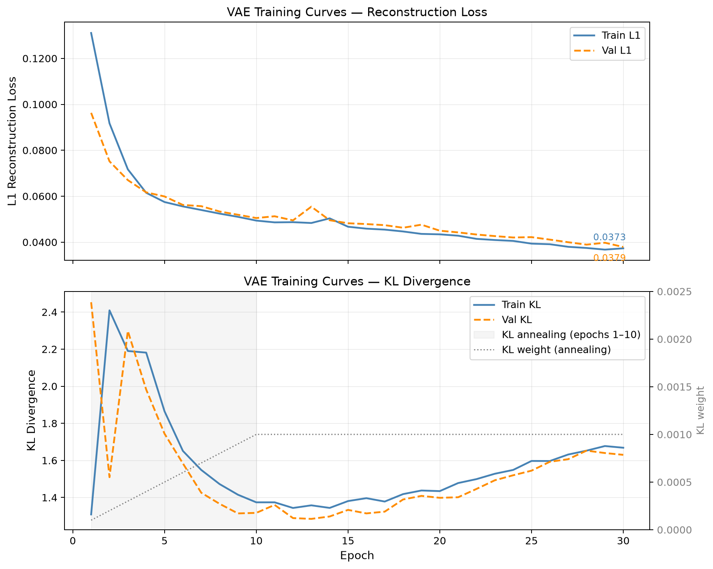
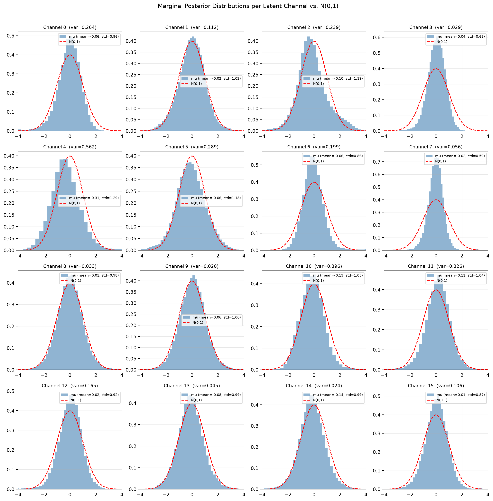
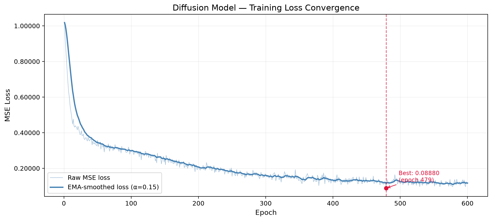
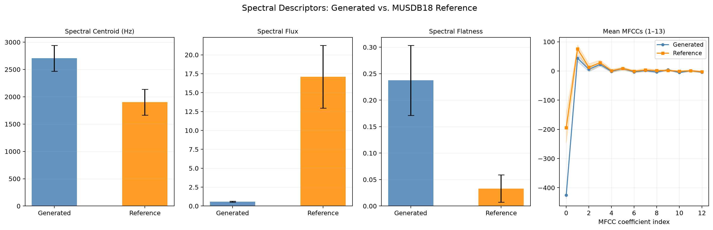

# Latent Diffusion Music Generation

Unconditional music generation from raw audio, using a **variational autoencoder (VAE)** to compress mel-spectrograms into a compact latent space, and a **U-Net denoising diffusion model** trained to generate new samples in that latent space.

Trained and evaluated on **MUSDB18** (150 professionally recorded multi-track songs), using only the full mixtures — no text, label, or metadata conditioning. This repository accompanies the thesis *"Latent Space Diffusion Models for Music Generation from Audio Signals"* (FER Zagreb, 2026).

---

## Pipeline

```
raw audio (44.1 kHz)
      │  resample + mono
      ▼
log-mel spectrogram  (5512 Hz, 80 mel bins, 10 s chunks)
      │  VAE encoder
      ▼
latent space  (16 channels, 8× downsampled)
      │  DDPM forward/reverse process (T = 200 steps)
      ▼
generated latent  →  VAE decoder  →  mel-spectrogram
      │  Griffin-Lim
      ▼
generated waveform
```

- **Representation:** log-mel spectrograms, `n_fft=1024`, `hop=256`, `n_mels=80`, normalized to `[0, 1]`
- **VAE:** convolutional encoder/decoder with residual blocks, 3× downsampling, 16 latent channels, KL-annealed ELBO loss
- **Diffusion:** U-Net denoiser with sinusoidal time embeddings, trained in ε-prediction on the VAE's (frozen) posterior mean, linear noise schedule, `T = 200`
- **Vocoder:** Griffin-Lim phase reconstruction (no neural vocoder)

See [`models/vae.py`](models/vae.py), [`models/diffusion.py`](models/diffusion.py), and [`models/griffin_lim.py`](models/griffin_lim.py) for implementation details, and [`configuration/globals.py`](configuration/globals.py) for all hyperparameters.

## Generated samples

Five unconditional samples produced by sampling Gaussian noise, running the DDPM reverse process, decoding through the VAE, and reconstructing audio with Griffin-Lim. Spectrograms below are the model's own mel output before vocoding.

| Sample 1 | Sample 2 | Sample 3 |
|:---:|:---:|:---:|
|  |  |  |
| [🔊 1.mp3](generated/1.mp3) | [🔊 2.mp3](generated/2.mp3) | [🔊 3.mp3](generated/3.mp3) |

| Sample 4 | Sample 5 |
|:---:|:---:|
|  |  |
| [🔊 4.mp3](generated/4.mp3) | [🔊 5.mp3](generated/5.mp3) |

Listening to the samples, the model reliably produces recognizable harmonic and melodic structure — chord progressions and tonal centers are audible and visible as the horizontal banding in the spectrograms above. Rhythm and fine transients are the weak point: percussive detail is smeared, and the reconstructions carry the metallic, slightly noisy quality typical of Griffin-Lim phase estimation.

## Results

### VAE reconstruction quality

Evaluated on 1223 held-out 10-second chunks:

| Metric | Value |
|---|---|
| L1 reconstruction error | 0.0383 ± 0.0066 |
| Log-spectral distance | 0.4049 ± 0.0653 |
| Spectral centroid difference | 63.9 ± 48.4 Hz |




### Latent space quality

10 of the 16 latent channels are actively used, and per-channel posterior means track the target isotropic `N(0, 1)` prior closely, with no evidence of posterior collapse — a healthy target for the downstream diffusion model.



### Diffusion training

The U-Net denoiser was trained for 600 epochs, with MSE loss decreasing from 1.02 to 0.11 and a minimum of 0.0888 reached around epoch 479, converging smoothly with no instability.



### Generation quality (FAD & spectral descriptors)

Fréchet Audio Distance (VGGish embeddings, 200 generated + 200 reference chunks, 2000 embedding frames each):

| Comparison | FAD |
|---|---|
| Reference self-FAD (MUSDB → MUSDB) | 1.91 |
| Model (generated → MUSDB) | 15.72 |
| Ratio | ≈ 8.2× |

Spectral descriptors (generated vs. reference):

| Descriptor | Generated | Reference |
|---|---|---|
| Spectral centroid | 2706 Hz | 1902 Hz |
| Spectral flatness | 0.237 | 0.033 |
| Spectral flux | 0.58 | 17.11 |



The elevated FAD and the higher centroid/flatness combined with lower flux quantify what's audible in the samples: the generated audio is brighter, noisier, and more static over time than real mixtures — consistent with strong harmonic content but weak rhythmic/transient modeling.

## Dataset & preprocessing

1. `dataset/export_mixture.py` — extracts the full mixture stem from MUSDB18 `.stem.mp4` files into WAV
2. `dataset/create_chunks.py` — cuts each track into fixed-length (10 s) chunks, discarding incomplete remainders
3. `dataset/mel_dataset.py` — resamples to 5512 Hz, computes log-mel spectrograms, normalizes to `[0, 1]`, pads to a multiple of 8 for the VAE's downsampling factor

## Training

- `train/train_vae.ipynb` — trains the VAE (30 epochs, KL-annealed over the first 10)
- `train/train_diffusion.ipynb` — encodes the dataset with the frozen VAE, then trains the latent U-Net denoiser (600 epochs)

## Evaluation notebooks

| Notebook | Experiment |
|---|---|
| `testing/exp1_vae_training_curves.ipynb` | VAE loss curves |
| `testing/exp2_vae_reconstruction.ipynb` | Reconstruction fidelity (L1, log-spectral distance, centroid) |
| `testing/exp3_latent_space.ipynb` | Latent channel activity & posterior analysis |
| `testing/exp4_fad.ipynb` | Fréchet Audio Distance |
| `testing/exp5_spectral_descriptors.ipynb` | Spectral centroid / flatness / flux comparison |
| `testing/exp6_diffusion_loss_curve.ipynb` | Diffusion training convergence |

## Known limitations

- The 5512 Hz sample rate and 80 mel bands trade off high-frequency fidelity for computational feasibility
- Griffin-Lim introduces phase artifacts that a neural vocoder (e.g. HiFi-GAN) would avoid
- MUSDB18's 150 tracks are a small dataset for capturing the full diversity of music that VGGish-based FAD is sensitive to
- No conditioning (genre, mood, text) — generation is fully unconditional

Full write-up, related work, and mathematical background are in [`master_thesis.pdf`](master_thesis.pdf).
